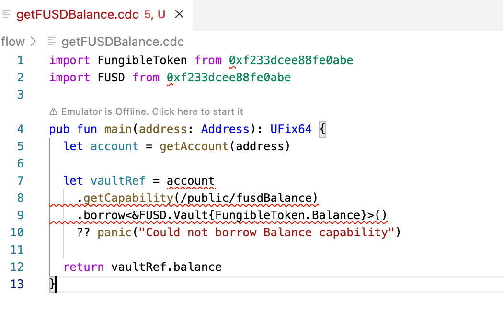

# cadence-webpack-plugin

Webpack plugin that helps importing .cdc files and polyfills fcl dependencies

This fixes the [Buffer is not defined](https://github.com/onflow/fcl-js/issues/1083) and [Module not found: Error: Can't resolve 'http'](https://github.com/onflow/fcl-js/issues/982) bugs

## Install
```sh
npm i cadence-webpack-plugin -D
```

## Usage

```js
import MINT_NFT from './flow/mint-nft.cdc'

await mutate({
  cadence: MINT_NFT,
  // ...
});
```


## Before/After

This plugin helps improve the development experience by allowing the import of Cadence code within a `.cdc` file directly in Javascript, instead of needing to wrap the Cadence code in a Javascript `const` wrapper.

Previously we may have needed to do the following:

```js
export const GET_FUSD_BALANCE = `
  import FungibleToken from 0xFungibleToken
  import FUSD from 0xFUSD

  pub fun main(address: Address): UFix64 {
  let account = getAccount(address)

  let vaultRef = account
  .getCapability(/public/fusdBalance)
  .borrow<&FUSD.Vault{FungibleToken.Balance}>()
  ?? panic("Could not borrow Balance capability")

  return vaultRef.balance
  }
`
```

Importing directly into JS without wrapping the Cadence code allows us to see the syntax highlighting when modifying the Cadence code because it is in its native `.cdc` format.

Example:




Now you can remote all constants and use the .cdc file into your web system.


## Setup with Webpack

In your webpack.config.js

```js
const CadencePlugin = require('cadence-webpack-plugin')

module.exports = {
  // ...
  plugins: [
    new CadencePlugin(),
    // ...
  ]
}
```

## Shortcut setup with [Nullstack](https://nullstack.app)

In your webpack.config.js

```js
const [server, client] = require('nullstack/webpack.config');
const { applyCadencePlugin } = require('cadence-webpack-plugin')

module.exports = applyCadencePlugin([server, client])
```

## License

This project is released under the [MIT License](https://opensource.org/licenses/MIT).